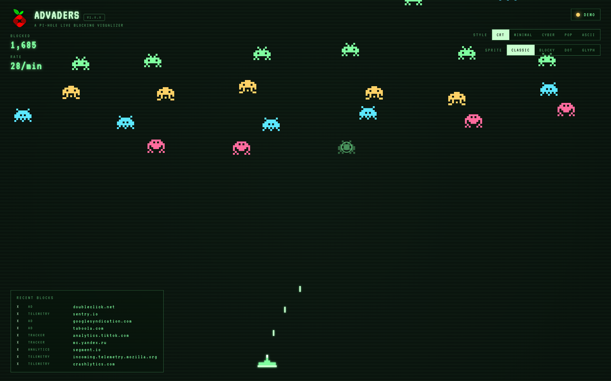
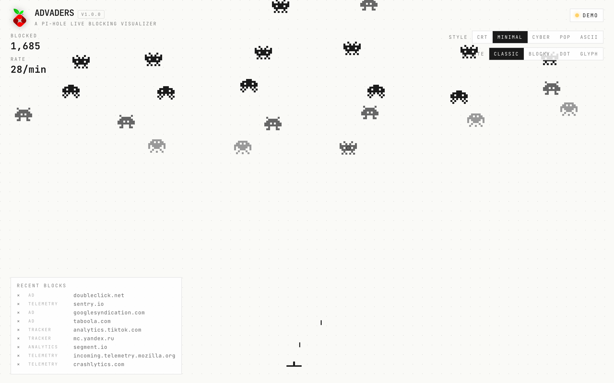
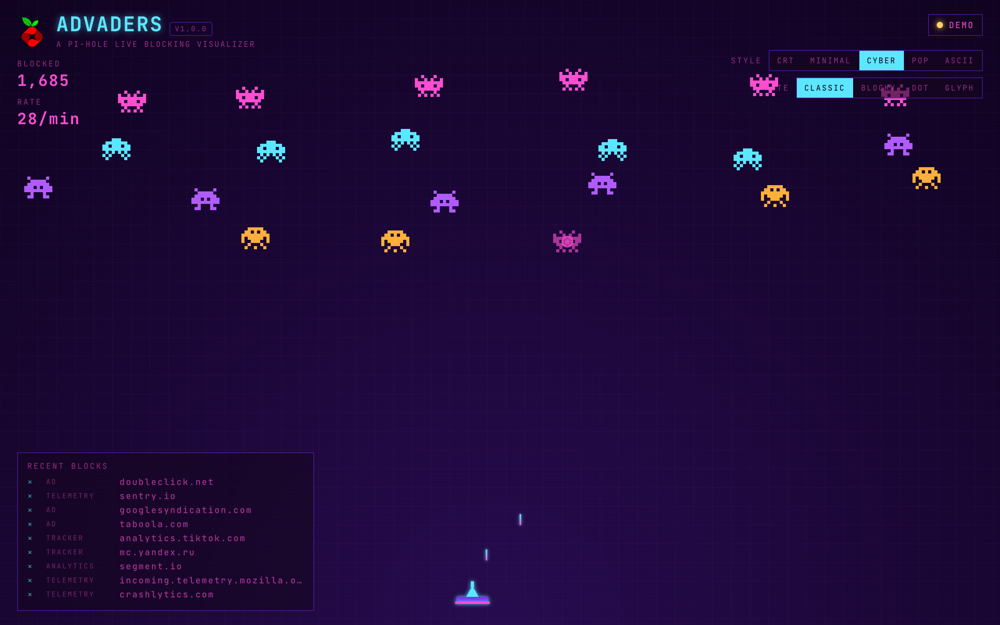
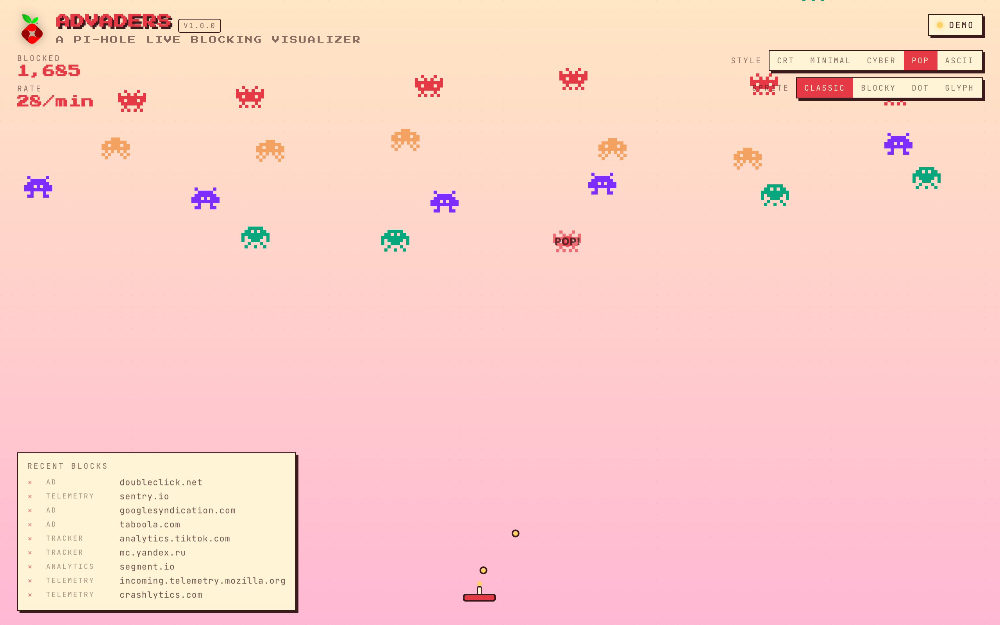
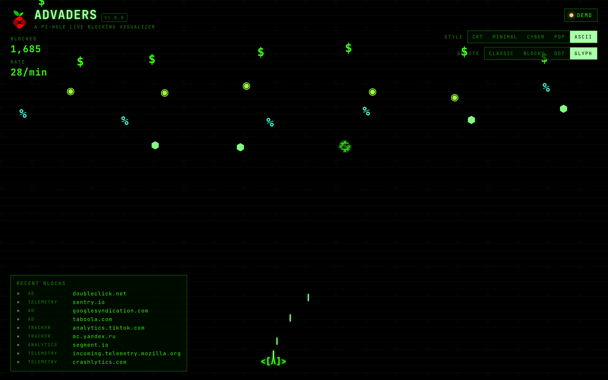
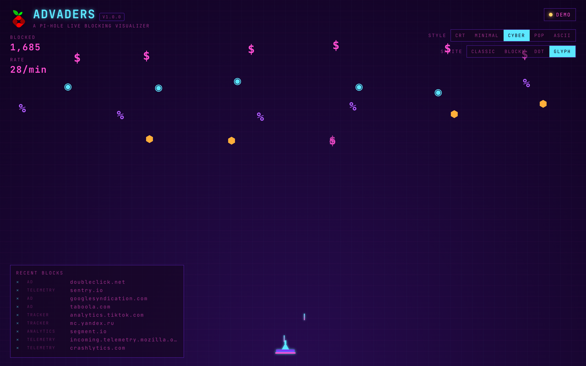
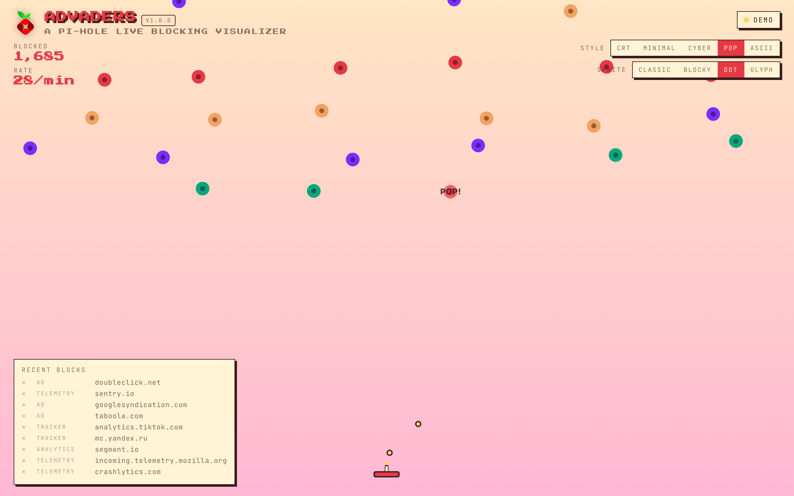

<p align="center">
  
</p>

<h1 align="center">
  Advaders
  <br>
  <sub><sup>a Pi-hole live blocking visualizer</sup></sub>
</h1>

<p align="center">
  built for <a href="https://pi-hole.net">Pi-hole</a> &nbsp;
  <a href="https://pi-hole.net"></a>
</p>

<p align="center">
  <a href="https://github.com/milouk/advaders/actions/workflows/build.yml"></a>
  <a href="https://milouk.me/advaders/"></a>
  <a href="https://github.com/milouk/advaders/pkgs/container/advaders"></a>
  <a href="https://github.com/milouk/advaders"></a>
  <a href="https://github.com/milouk/advaders/commits/main"></a>
  <a href="LICENSE"></a>
  <a href="https://ko-fi.com/milouk"></a>
</p>

> A companion visualizer for [**Pi-hole**](https://pi-hole.net/). Every blocked DNS query falls from the top as a Space Invader; the defender at the bottom auto-zaps each one. It never misses — Pi-hole always blocks, so the visualization always lands the shot.

Live data via the Pi-hole v6 API. No Pi-hole? The frontend runs a built-in demo automatically — that's how the [live demo](https://milouk.me/advaders/) works.

**🕹️ Try the live demo: <https://milouk.me/advaders/>**

Zero-config self-host: `docker run -p 3000:3000 ghcr.io/milouk/advaders:latest` — done.



## Themes

Five full visual languages, switchable from the top-right toolbar. Selection persists across reloads.

### A · Retro CRT

Phosphor green, scanlines, classic arcade HUD.


### B · Minimal

Quiet dashboard, monochrome, dot-grid background.



### C · Cyberpunk

Magenta/cyan glow, scanline grid, radial vignette.



### D · Pop

Bold colors, chunky borders, drop-shadow comic style.



### E · ASCII

Pure terminal: green-on-black, ASCII defender (`<[Λ]>`), `|` shots, character-burst explosions.



## Sprite styles

Four orthogonal sprite packs — pick any combination with any theme.

- **classic** — 9×7 hand-drawn pixel aliens with two-frame animated wobble
- **blocky** — same patterns, rounded pixels
- **dot** — minimal: a filled circle per invader, color-coded by category
- **glyph** — typographic: `$` `◉` `%` `⬢` for ad / tracker / analytics / telemetry




## Run

### Docker

```bash
docker run -d --name advaders -p 3000:3000 \
  -e PIHOLE_URL=https://pi.hole \
  -e PIHOLE_PASSWORD=changeme \
  ghcr.io/milouk/advaders:latest
```

Open <http://localhost:3000>.

### Docker Compose

```bash
cp .env.example .env
# edit PIHOLE_URL + PIHOLE_PASSWORD
docker compose up -d
```

### Local Node

```bash
node server.js                                                # demo mode
PIHOLE_URL=https://pi.hole PIHOLE_PASSWORD=xxx node server.js # live
```

Without `PIHOLE_URL` the server simply replies `{connected:false}` and the frontend runs in built-in demo mode — same code path that powers the live demo on GitHub Pages.

## Configuration

Every knob is an env var.

| Variable              | Default            | Description                                          |
| --------------------- | ------------------ | ---------------------------------------------------- |
| `PORT`                | `3000`             | Listen port                                          |
| `HOST`                | `0.0.0.0`          | Bind address                                         |
| `TITLE`               | `ADVADERS`         | HUD title + browser tab                              |
| `PIHOLE_URL`          | _(unset)_          | Pi-hole v6 base URL, e.g. `https://pi.hole`          |
| `PIHOLE_PASSWORD`     | _(unset)_          | Pi-hole web UI password                              |
| `PIHOLE_INSECURE_TLS` | `false`            | Accept self-signed certs                             |
| `PIHOLE_QUERY_LENGTH` | `200`              | `length` param sent to Pi-hole `/api/queries`        |
| `POLL_INTERVAL_MS`    | `2000`             | How often the browser polls the proxy                |
| `DEFAULT_THEME`       | `crt`              | `crt` \| `minimal` \| `cyber` \| `pop` \| `ascii`    |
| `DEFAULT_SPRITE`      | `classic`          | `classic` \| `blocky` \| `dot` \| `glyph`            |

`?theme=`, `?sprite=`, and `?seed=N` URL params override defaults at runtime (used by the screenshot script and for sharing specific looks).

## Pi-hole v6 setup

1. In Pi-hole admin, set a web UI password (Settings → Admin).
2. Pass that password as `PIHOLE_PASSWORD`. Advaders authenticates via `POST /api/auth` and reuses the session until it expires (handled automatically).
3. Make sure the Pi-hole URL is reachable from the container — usually direct LAN access or a shared Docker network.

## Develop

```bash
npm install            # only needed for the screenshot tooling
node server.js         # boot dev server in demo mode
npm run screenshots    # regenerate docs/screenshots/*.png (Chrome required)
```

The frontend is plain ES2020 (canvas + DOM) with no build step. The server is one file, zero runtime dependencies (Node ≥ 20, uses native `fetch`).

## Architecture

```text
browser ──► api/config        (boot-time defaults)
        ──► api/queries       (blocked queries, polled)

server  ──► Pi-hole v6 /api/auth + /api/queries

(no Pi-hole reachable → frontend's built-in demo mode kicks in)
```

The browser polls `api/queries?since=<ts>`; the server proxies to Pi-hole, filters for blocked statuses (`GRAVITY`, `REGEX`, `DENYLIST`, etc.), and returns a normalized list. The frontend canvas engine spawns one invader per blocked query, the defender homes in, and a kill-line at `H − 80px` guarantees no leakers. When the API isn't reachable (no `PIHOLE_URL`, GitHub Pages, network blip) the same engine drives a built-in demo stream so the visualization stays alive.

## Contributing

PRs welcome — open an issue first if you're planning anything substantial. The code is intentionally small and dependency-free; please keep it that way.

## Support

If Advaders made you smile while watching ads die, consider buying me a coffee — it keeps the lasers green.

<a href="https://ko-fi.com/milouk"></a>

## License

[MIT](LICENSE) © Michael Loukeris
